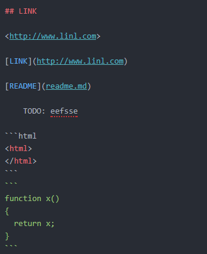

# h1 title

h1 title
===

## h2 title

h2 title
---

###### h6 title


hello,  
hello, hello, hello, hello, hello, hello, hello, hello, hello, hello, hello, hello, hello,
## 引用
>hello, hello, hello, hello, hello, hello, hello, hello, hello, hello, hello, hello, hello, hello,  

hello, hello, hello, hello, hello, hello, hello, hello, hello, hello, hello, hello, hello, hello,

hello, hello, hello, hello, hello, hello, hello, hello, hello, hello, hello, hello, hello, hello,


## 区切り

***
---
___

斜体*斜体*斜体*斜体*斜体*斜体*

太字**太字太字太字太字太字太字太字**

- qqqqqqqqqq
  - wwwwwwwwwwwww

hello, hello, hello, hello, hello,

     hello, hello, hello, hello, hello, hello, hello, hello, hello,  
     hello, hello, hello, hello, hello, hello,

  hello, hello, hello, hello, hello, hello, hello, hello,

1. item1
  1. item
  1. item
  1. item
1. item1
1. item1
1. item1
1. **item1**

## LINK

<http://www.linl.com>

[LINK](http://www.linl.com)

[README](readme.md)

    TODO: eefsse

```html
<html>
</html>
```
```
function x()
{
  return x;
}
```

```cs
void main()
{
  jhpof;
}
```
- c# cs
- c言語 c
- java java

rjgih `return x;` gjijggo

## 画像


## 画像リンク　　
[](http://dotinstall.com/)

---
## rRR



## テーブル

|列見出し|列見出し|列見出し|  
|:------|:-:|------:|
|左揃え|中央揃え|右揃え|
|0|0|0|
